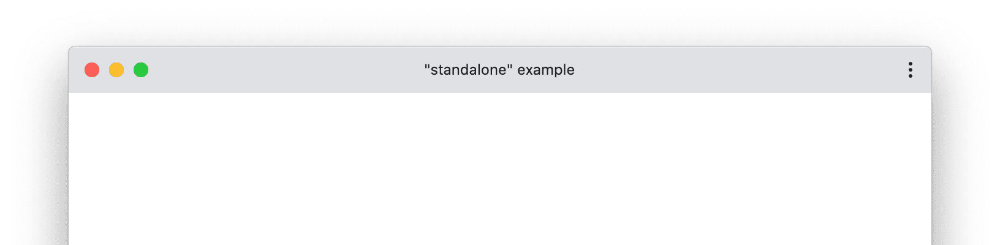
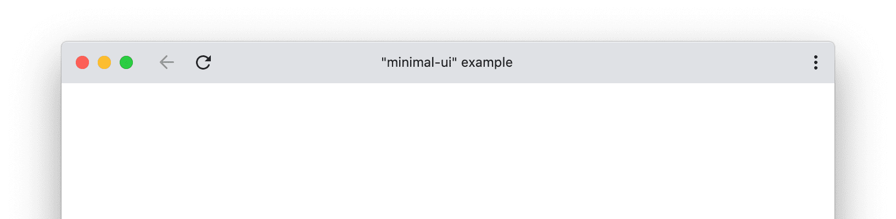
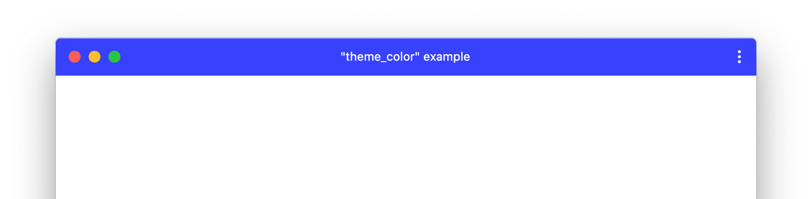
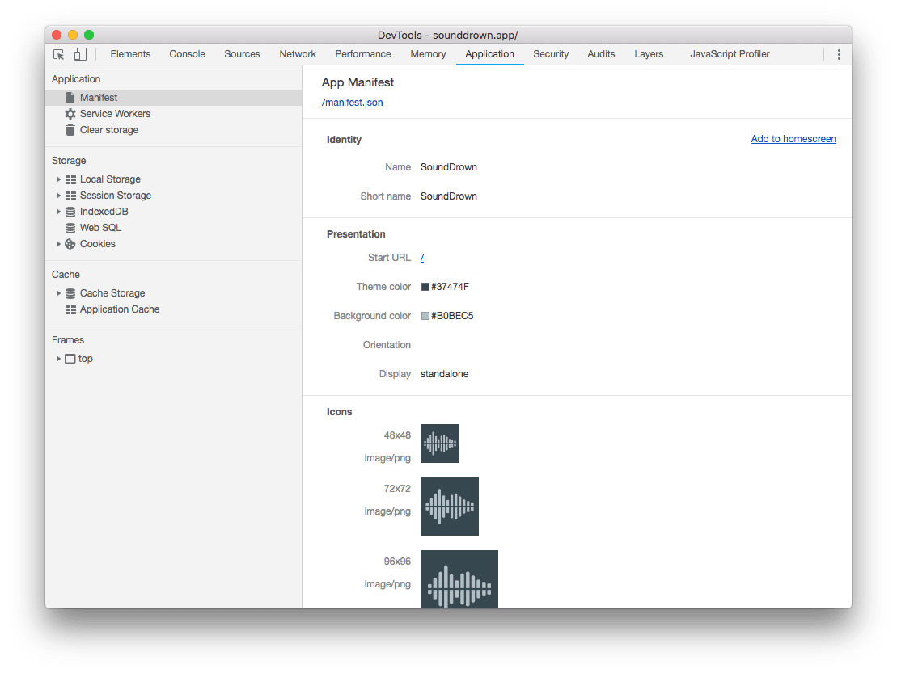

# 웹 앱에 매니페스트 추가하기

웹 앱 매니페스트는 **PWA**에 대해 브라우저에 알려주는 JSON 파일이며,
사용자의 PC 또는 모바일 장치에 설치할 때 어떻게 작동해야 하는지 알려줍니다.
일반적인 매니페스트 파일에는 앱 이름, 앱에서 사용해야 하는 아이콘, 앱이 시작될 때 열어야 하는 URL이 포함됩니다.

매니페스트 파일은 Chrome, Edge, Firefox, UC Browser, Opera 및 Samsung 브라우저에서 지원됩니다.
Safari는 부분적으로 지원합니다.

## 매니페스트 파일 만들기

매니페스트 파일의 사양은 확장자가 `.webmanifest` 여야 한다고 제안하지만,
일반적으로 브라우저는 `.json` 확장자도 지원하므로 `manifest.json`으로 이름이 지정되고,
루트 (웹 사이트의 최상위 디렉터리)에서 제공됩니다.

아래는 `manifest.json`의 주요 구성요소를 나열한 것입니다.

> 관련 스팩 [링크(W3C)](https://www.w3.org/TR/appmanifest/)
>
> 관련 정보 빠른 참조 [링크(MDN)](https://developer.mozilla.org/en-US/docs/Web/Manifest)

```json
{
  "short_name": "Weather",
  "name": "Weather: Do I need an umbrella?",
  "description": "Weather forecast information",
  "start_url": "/?source=pwa",
  "scope": "/",
  "display": "standalone",
  "background_color": "#3367D6",
  "theme_color": "#3367D6",
  "icons": [
    {
      "src": "/images/icons-192.png",
      "type": "image/png",
      "sizes": "192x192"
    },
    {
      "src": "/images/icons-512.png",
      "type": "image/png",
      "sizes": "512x512"
    }
  ],
  "shortcuts": [
    {
      "name": "How's weather today?",
      "short_name": "Today",
      "description": "View weather information for today",
      "url": "/today?source=pwa",
      "icons": [{ "src": "/images/today.png", "sizes": "192x192" }]
    },
    {
      "name": "How's weather tomorrow?",
      "short_name": "Tomorrow",
      "description": "View weather information for tomorrow",
      "url": "/tomorrow?source=pwa",
      "icons": [{ "src": "/images/tomorrow.png", "sizes": "192x192" }]
    }
  ],
  "screenshots": [
    {
      "src": "/images/screenshot1.png",
      "type": "image/png",
      "sizes": "540x720"
    },
    {
      "src": "/images/screenshot2.jpg",
      "type": "image/jpg",
      "sizes": "540x720"
    }
  ]
}
```

## `manifest`의 구성요소

### `name`(필수), `short_name`

최소한 `name` 또는 `short_name` 특성을 제공해야 합니다.
둘 다 제공되는 경우 사용자의 홈 화면, 런처 또는 공간이 제한될 수 있는 기타 장소에서 `short_name`이 사용됩니다.
`name`은 앱이 설치될 때 사용됩니다.

### `description`

앱을 설명합니다.

### `start_url`(필수)

앱이 시작될 때 앱이 시작되어야 하는 위치(주소)를 브라우저에 알립니다.

### `scope`

`scope`은 브라우저가 앱 내에 있는 것으로 간주하는 URL 집합을 정의하며,
사용자가 앱을 떠나는 시기를 결정하는 데 사용됩니다.
`scope`은 웹 앱의 모든 진입점과 종료 지점을 포함하는 URL 구조를 제어합니다.
`start_url`은 `scope` 내에 있어야 합니다.

### `display`

앱이 시작될 때 표시되는 브라우저 UI를 사용자 지정할 수 있습니다.
예를 들어 주소 표시 줄과 브라우저 크롬을 숨길 수 있습니다.
전체 화면으로 실행되도록 게임을 만들 수도 있습니다.

| 속성			| 설명					|
| :---: 	| :---        |
| `fullscreen` | 브라우저 UI 없이 웹 응용 프로그램을 열고 사용 가능한 표시 영역의 전체를 차지합니다. |
| `standalone` | 웹 앱을 열어 독립형 앱처럼 보이고 느껴집니다. 앱은 브라우저와 별도로 자체 창에서 실행되며 URL 표시 줄과 같은 표준 브라우저 UI 요소를 숨깁니다.  |
| `minimal-ui` | 이 모드는 `standalone`과 유사하지만, 사용자에게 탐색 제어(예: 뒤로 및 다시 로드)를 위한 최소 UI 요소 집합을 제공합니다.  |
| `browser` | 브라우저로 실행합니다. |

### `background_color`

앱이 모바일에서 처음 시작될 때 스플래시 화면에서 사용됩니다.

### `theme_color`

`theme_color`는 도구 모음(주소표시줄)의 색상을 설정하며, 작업 전환기의 앱 미리 보기에 반영될 수 있습니다.
`theme_color`는 HTML 문서 `&lt;head&gt;` 내에 지정된 `&lt;meta name="theme-color" content="값"&gt;`의 값과 일치해야 합니다.


### `icons`

사용자가 **PWA**를 설치할 때 브라우저가 홈 화면, 앱 실행기, 작업 전환기, 스플래시 화면 등에서 사용할 아이콘 세트를 정의할 수 있습니다.

`icons` 속성은 이미지 객체의 배열입니다.
각 개체는 `src`, `sizes`, `type`을 포함해야 합니다.
**Android**에서 [적응형 아이콘](https://web.dev/maskable-icon/) 이라고도 하는 마스킹 가능한 아이콘을 사용하려면 `icon` 속성에 `"purpose" : "any maskable"`도 추가해야 합니다.

**Chrome**의 경우 최소 `192x192` 픽셀 아이콘과 `512x512` 픽셀 아이콘을 제공해야 합니다.
이 두 가지 아이콘 크기만 제공되는 경우 **Chrome**은 기기에 맞게 아이콘 크기를 자동으로 조정합니다.
자체 아이콘의 크기를 조정하고 픽셀 완벽에 맞게 조정하려면 아이콘을 `48dp` 단위로 제공하세요.

### `shortcuts`

앱 내의 주요 작업에 대한 빠른 액세스를 제공하는 것을 목표로 하는 앱 바로가기 객체로 이루어진 배열입니다.
각 객체는 적어도 `name`과 `url`을 포함해야 합니다.

### `screenshots`

일반적인 사용 시나리오에서 앱을 나타내는 이미지 객체의 배열입니다.
각 객체는 `src`, `sizes`, `type`을 포함해야 합니다.

**Chrome**에서 이미지는 특정 기준에 응답해야 합니다.

- 너비와 높이는 `320px ~ 3840px` 여야 합니다.
- 최대 치수는 최소 치수보다 두 배 클 수 없습니다.
- 스크린샷은 가로세로 비율이 같아야 합니다.
- `JPEG` 및 `PNG` 이미지 형식만 지원됩니다.

## 페이지에 웹 앱 manifest 추가

```html
&lt;link rel="manifest" href="/manifest.json"&gt;
```
&gt; 주의!
&gt;
&gt; 매니페스트에 대한 요청은 인증 정보 없이 이루어지므로(같은 도메인에 있더라도),
&gt; 매니페스트에 자격 증명이 필요한 경우 태그에 `crossorigin="use-contententials"`를 포함해야 합니다.

## manifest 테스트

매니페스트가 올바르게 설정되었는지 확인하려면 Chrome DevTools 의 애플리케이션 패널에서 매니페스트 창을 사용하세요.

이 창은 매니페스트의 많은 속성을 사람이 읽을 수 있는 버전으로 제공하며,
모든 이미지가 제대로 로드되고 있는지 쉽게 확인할 수 있습니다.



## 모바일 스플래시 화면

앱이 모바일에서 처음 실행될 때, 브라우저에서 초기 콘텐츠 렌더링을 시작하는 데 시간이 걸릴 수 있습니다.
사용자에게 앱이 멈춘 것처럼 보일 수 있는 흰색 화면을 표시하는 대신,
브라우저는 첫 번째 페인트(렌더링 후 화면)가 나올 때까지 스플래시 화면을 표시합니다.

특별히 **Chrome**은 다음과 같은 매니페스트 속성을 활용하여 스플래시 화면을 자동으로 만듭니다.

- `name`
- `background_color`
- `icons`

`background_color`는 스플래시 화면에서 앱으로 매끄럽게 전환 될 수 있도록,
로드될 페이지와 같은 색상 값으로 하는 것이 좋습니다.

**Chrome**은 기기의 해상도와 거의 일치하는 아이콘을 선택합니다.
대부분은 `192px` 및 `512px` 아이콘을 제공하는 것으로 충분하지만,
픽셀 완성도를 위해 추가 아이콘을 제공할 수 있습니다.
