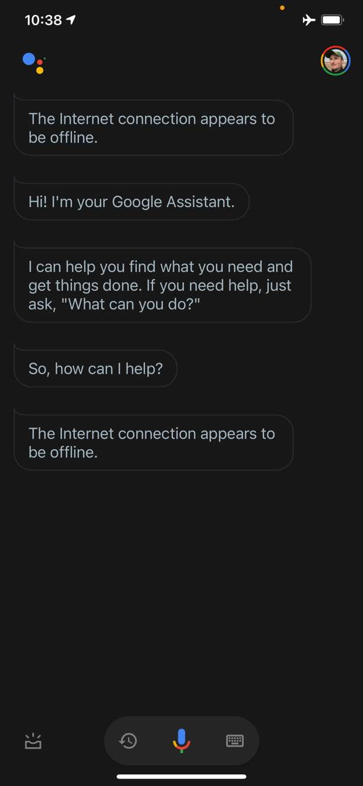
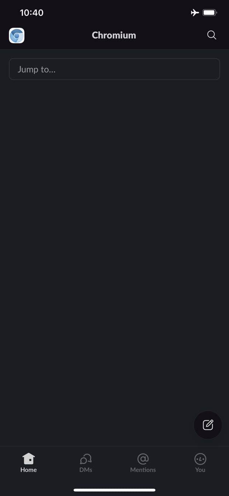
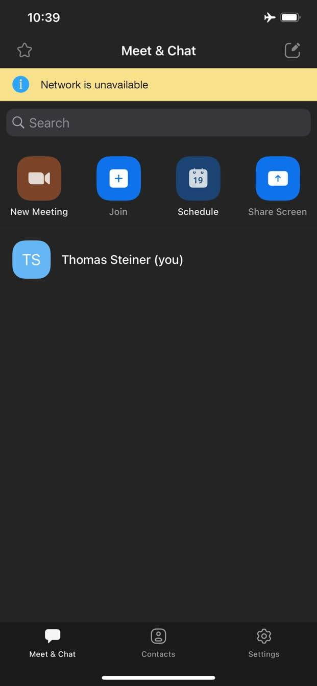
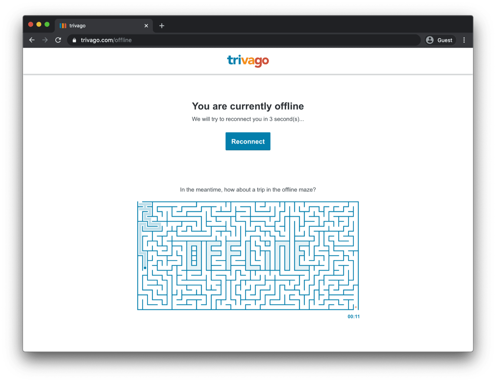

# 오프라인 대체 페이지 만들기

Google 어시스턴트, Slack, Zoom, 핸드폰이나 PC에 있는 거의 모든 기본 앱의 공통점은 무엇인가요?
맞습니다!
그들은 항상 최소한 당신에게 무언가를 보여줍니다.
네트워크에 연결되어 있지 않아도 어시스턴트, Slack, Zoom 을 실행할 수 있습니다.
특별히 의미있는 것을 얻지 못하거나 원하는 것을 못할 수도 있지만,
적어도 무언가를 보고 앱을 제어 할 수는 있습니다.

| 어시스턴트 						| Slack							 | Zoom								 |
| :---: 						 | :---:							 | :---: 							 |
|  |  |  |

반대로, 전통적인 브라우저 웹페이지는 오프라인일 때 아무것도 볼 수 없습니다.

## 커스텀 서비스 워커가있는 오프라인 폴백 페이지

[서비스 워커와 Cache Storage API](https://web.dev/service-workers-cache-storage/) 덕분에 사용자에게 맞춤화 된 오프라인 환경을 제공 할 수 있습니다.
이것은 사용자가 현재 오프라인 상태라는 정보가 포함된 단순한 브랜드 페이지 일 수 있지만,
예를들어 수동 재연결 버튼과 자동 재연결 시도가 있는 유명한 [트리바고 오프라인 미로 게임처럼](https://www.trivago.com/offline) 더 창의적인 솔루션이 될 수도 있습니다.



## 서비스 워커 등록

이를 가능하게하는 방법은 서비스 워커를 이용하는 것입니다.
아래 샘플 코드처럼 메인페이지에서 서비스 워커를 등록 할 수 있습니다.
일반적으로 앱이 로드되면 이 작업을 수행합니다.

```js
window.addEventListener("load", () => {
  if ("serviceWorker" in navigator) {
    navigator.serviceWorker.register("service-worker.js");
  }
});
```

## 서비스 워커 코드

실제 서비스 워커 파일의 내용은 언뜻보기에는 약간 관련이있는 것처럼 보일 수 있지만,
아래 샘플의 주석은 문제를 해결해야합니다.
핵심 아이디어는 실패한 탐색 요청에만 제공되는 `offline.html`이라는 파일을 사전 캐시하고,
브라우저가 다른 모든 경우를 처리하도록하는 것입니다.

```js
// OFFLINE_VERSION 을 늘리면 설치 이벤트가 시작되고,
// 이전에 캐시 된 리소스가 네트워크에서 업데이트됩니다.
const OFFLINE_VERSION = 1;
const CACHE_NAME = "offline";
// 필요한 경우 다른 URL로 사용자 정의하십시오.
const OFFLINE_URL = "offline.html";

self.addEventListener("install", (event) => {
  event.waitUntil(
    (async () => {
      const cache = await caches.open(CACHE_NAME);
      // new Request 에서 {cache: 'reload'} 를 설정하면 HTTP 캐시에서 응답을 수행하지 않습니다.
			// 즉, 네트워크에서 가져오는 것입니다.
      await cache.add(new Request(OFFLINE_URL, { cache: "reload" }));
    })()
  );
  // 대기중인 서비스 워커가 활성 서비스 워커가되도록 강제합니다.
  self.skipWaiting();
});

self.addEventListener("activate", (event) => {
  event.waitUntil(
    (async () => {
      // 지원되는 경우 탐색 미리로드를 활성화합니다.
      // https://developers.google.com/web/updates/2017/02/navigation-preload
      if ("navigationPreload" in self.registration) {
        await self.registration.navigationPreload.enable();
      }
    })()
  );

  // 활성 서비스 워커에게 페이지를 즉시 제어하도록 지시하십시오.
  self.clients.claim();
});

self.addEventListener("fetch", (event) => {
  // HTML 페이지에 대한 탐색 요청 인 경우에만 event.respondWith()를 호출하려고 합니다.
  if (event.request.mode === "navigate") {
    event.respondWith(
      (async () => {
        try {
          // 먼저, 지원되는 경우 탐색 사전로드 응답을 사용하십시오.
          const preloadResponse = await event.preloadResponse;
          if (preloadResponse) {
            return preloadResponse;
          }

          // 항상 네트워크를 먼저 시도하십시오.
          const networkResponse = await fetch(event.request);
          return networkResponse;
        } catch (error) {
          // catch 는 네트워크 오류로 인한 예외가 발생하는 경우에만 트리거됩니다.
          // fetch()가 4xx 또는 5xx 범위의 응답 코드와 함께 유효한 HTTP 응답을 반환하면,
					// catch()가 호출되지 않습니다.
          console.log("가져 오기 실패 : 대신 오프라인 페이지를 반환합니다.", error);

          const cache = await caches.open(CACHE_NAME);
          const cachedResponse = await cache.match(OFFLINE_URL);
          return cachedResponse;
        }
      })()
    );
  }

  // if () 조건이 거짓이면이 페치 핸들러는 요청을 가로채지 않습니다.
  // 다른 페치 핸들러가 등록되어 있으면 event.respondWith()를 호출 할 기회를 얻게됩니다.
	// 페치 핸들러가 event.respondWith()를 호출하지 않으면,
	// 요청은 서비스 워커가 관여하지 않은 것처럼 브라우저에서 처리됩니다.
});
```

## 오프라인 대체 페이지

이 `offline.html` 파일은 창의성을 발휘하고 필요에 맞게 조정하고 브랜딩을 추가 할 수있는 곳입니다.
아래 예는 가능한 최소한의 것을 보여줍니다.

> 오프라인 페이지에 필요한 모든 리소스를 캐시해야 합니다.
> 이를 처리하는 방법 중 하나는 모든 것을 인라인으로 처리하는 것입니다.

```html
<!DOCTYPE html>
<html lang="en">
  <head>
    <meta charset="utf-8" />
    <meta http-equiv="X-UA-Compatible" content="IE=edge" />
    <meta name="viewport" content="width=device-width, initial-scale=1" />

    <title>You are offline</title>

    <!-- inline the webpage's stylesheet -->
    <style>
      body {
        font-family: helvetica, arial, sans-serif;
        margin: 2em;
      }

      h1 {
        font-style: italic;
        color: #373fff;
      }

      p {
        margin-block: 1rem;
      }

      button {
        display: block;
      }
    </style>
  </head>
  <body>
    <h1>You are offline</h1>

    <p>Click the button below to try reloading.</p>
    <button type="button">⤾ Reload</button>

    <!-- inline the webpage's javascript file -->
    <script>
      document.querySelector("button").addEventListener("click", () => {
        window.location.reload();
      });
    </script>
  </body>
</html>
```

## 앱 설치 가능에 대한 참고 사항

이제 사이트에 오프라인 대체 페이지가 있으므로 다음 단계에 대해 궁금해 할 수 있습니다.
앱을 설치 가능하게 만들려면 [웹 앱 매니페스트](./add-manifest.md)를 추가하고 [설치 전략을](./customize-install.md) 제시해야 합니다.

## Workbox.js를 사용하여 오프라인 대체 페이지 제공에 대한 참고 사항

[Workbox.js에](https://developers.google.com/web/tools/workbox) 대해 들어보셨을 것입니다.
Workbox.js는 웹 앱에 오프라인 지원을 추가하기위한 JavaScript 라이브러리 세트입니다.
서비스 워커 코드를 적게 작성하려는 경우 [오프라인 페이지에만](https://developers.google.com/web/tools/workbox/guides/advanced-recipes#offline_page_only) Workbox.js 레시피를 사용할 수 있습니다 .


