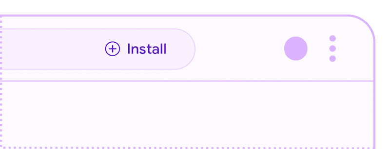
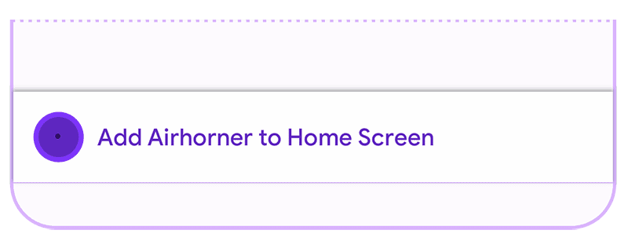

# 설치하려면 무엇이 필요합니까?

PWA(Progressive Web Apps)는 웹 기술을 사용하여 구축된 최신 고품질 앱입니다.
PWA는 iOS / Android / 데스크톱 앱과 유사한 기능을 제공하며,
불안정한 네트워크 조건에서도 안정적이며 설치가 가능하여 사용자가 쉽게 찾고 사용할 수 있습니다.

대부분의 사용자는 앱 설치와 설치 환경의 이점에 익숙합니다.
설치된 앱은 Mac OS X의 응용 프로그램 폴더, Windows의 시작 메뉴, Android 및 iOS의 홈 화면과 같은 운영 체제 실행 화면에 나타납니다.

대부분의 브라우저는 특정 기준을 충족 할 때 PWA를 설치 할 수 있음을 사용자에게 표시합니다.
표시의 예로는 주소 표시 줄의 설치 버튼이나 오버플로 메뉴의 설치 메뉴 항목이 있습니다.

| PC 브라우저 설치 프로모션 | 모바일 브라우저 설치 프로모션 |
| :---: | :---: |
|  |  |

또한 기준이 충족되면 많은 브라우저에서 `beforeinstallprompt` 이벤트를 실행하여 앱 내에서 설치 과정을 트리거하는 사용자 지정 인앱 UX를 제공 할 수 있습니다.

## 설치 조건

Chrome에서 프로그레시브 웹 앱은 `beforeinstallprompt` 이벤트를 시작하고 브라우저 내 설치 프로모션을 표시하기 전에 다음 기준을 충족해야합니다 .

- 웹 앱이 아직 설치되지 않음
- 사용자 의도의 액션(user engagement heuristic) 충족
- HTTPS를 통해 제공
- 다음을 포함하는 웹 앱 매니페스트
	- `short_name` 또는 `name`
	- `icons` - 192px 및 512px 아이콘 포함. 
	- `start_url` 
	- `display` - `fullscreen`, `standalone`, `minimal-ui` 중 하나
	- 참고: `prefer_related_applications`는 존재하지 않거나 false [링크](https://developer.mozilla.org/en-US/docs/Web/Manifest/prefer_related_applications)
- `fetch` 핸들러로 서비스 워커를 등록합니다. 
	- 2021 년 중반부터 서비스 워커는 기기가 오프라인 일 때 유효한 응답을 반환해야합니다 (예 : [오프라인 대체 페이지](./offline-fallback-page.md)).

다른 브라우저의 설치 기준은 비슷하지만 약간의 차이가있을 수 있습니다.
자세한 내용은 각 사이트를 확인하십시오.

- [Edge](https://docs.microsoft.com/en-us/microsoft-edge/progressive-web-apps-chromium/#requirements)
- [Firefox](https://developer.mozilla.org/en-US/docs/Web/Progressive_web_apps/Add_to_home_screen#how_do_you_make_an_app_a2hs-ready)
- [Opera](https://dev.opera.com/articles/installable-web-apps/)
- [Samsung Internet](https://hub.samsunginter.net/docs/ambient-badging/)
- [UC Browser](https://plus.ucweb.com/docs/pwa/docs-en/zvrh56)

> Android 에서 웹 앱 매니페스트에 `related_applications`([링크](https://developer.mozilla.org/en-US/docs/Web/Manifest/related_applications)) 및 `"prefer_related_applications": true`([링크](https://developer.mozilla.org/en-US/docs/Web/Manifest/prefer_related_applications)) 가 포함 된 경우 사용자는 Google Play 스토어로 이동하고 대신 지정된 Android 앱을 설치하라는 메시지가 표시됩니다.

